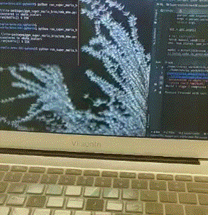

# [PYTORCH] 用A3C模型玩超级玛丽奥

## 简介

参考文章**Asynchronous Methods for Deep Reinforcement Learning** [paper](https://arxiv.org/abs/1602.01783).

  

## 训练方法
* **python main.py**

 
## Requirements

* **python 3.6**
* **gym**
* **cv2**
* **pytorch** 
* **numpy**
